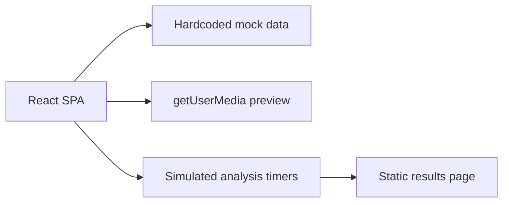
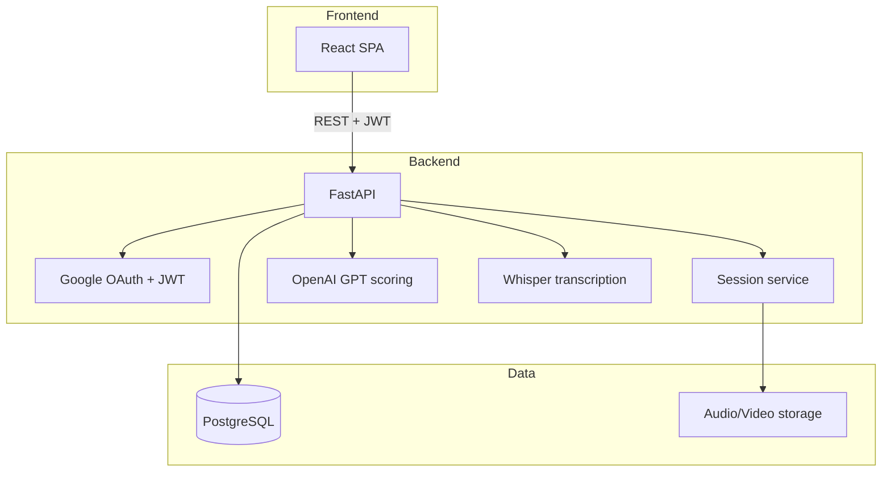

# Estrivesta / InterviewAI — Project Status

**Audit date:** 17 August 2026  
**Repository:** `/Users/anandkumarmandal/Desktop/estrivesta`  
**Git:** Not initialized (no `.git` directory)

---

## Executive Summary

The repository contains a **production-quality React frontend** for an AI video interview coaching platform. The UI is complete, builds successfully, and covers the full user journey from landing page through practice, live session, results, and analytics.

**Everything below the UI layer is missing.** There is no FastAPI backend, no PostgreSQL schema, no Google OAuth integration, no JWT auth, no OpenAI/Whisper pipeline, and no real data persistence. The app currently runs entirely on **hardcoded mock data** and **simulated timers**.

| Layer | Status | Completion |
|-------|--------|------------|
| React frontend (UI/UX) | Done | ~95% |
| Frontend ↔ API integration | Not started | 0% |
| FastAPI backend | Not present | 0% |
| PostgreSQL database | Not present | 0% |
| Google OAuth + JWT | UI shell only | ~5% |
| Interview recording pipeline | Camera preview only | ~10% |
| AI scoring (GPT) | Simulated | 0% |
| Speech transcription (Whisper) | Not present | 0% |
| Analytics (real data) | Mock charts only | ~30% UI |
| DevOps (Docker, CI, env) | Not present | 0% |

---

## Project Structure

```
estrivesta/
├── index.html                  # Vite entry HTML
├── package.json                # Frontend deps (React, Vite, Recharts, Supabase*)
├── vite.config.ts              # Vite + @ path alias
├── tsconfig*.json              # TypeScript config (allowJs: true)
├── tailwind.config.js          # Design tokens (dark theme)
├── postcss.config.js
├── eslint.config.js
├── dist/                       # Production build output (generated)
├── node_modules/
├── interview ai/               # Cursor/Bolt template metadata only
│   ├── config.json
│   └── prompt
└── src/
    ├── main.tsx                # React entry
    ├── App.tsx                 # Router (9 routes)
    ├── index.css               # Global styles + animations
    ├── vite-env.d.ts
    ├── hooks/
    │   └── useScrollReveal.ts
    ├── pages/                  # 9 page components (.jsx)
    │   ├── LandingPage.jsx
    │   ├── LoginPage.jsx
    │   ├── RegisterPage.jsx
    │   ├── DashboardPage.jsx
    │   ├── PracticePage.jsx
    │   ├── SessionPage.jsx
    │   ├── ResultsPage.jsx
    │   ├── ProgressPage.jsx
    │   └── QuestionBankPage.jsx
    └── components/
        ├── landing/            # Navbar, Hero, Features, Pricing, Footer, HowItWorks
        ├── dashboard/          # Sidebar, StatCard, SessionsTable, ProgressChart
        ├── interview/          # LiveMetrics, AnalysisLoader
        ├── results/            # ScoreRing, ScoreBar, FeedbackCards, TranscriptView
        └── shared/             # Button, Card, Badge, LoadingSkeleton
```

**Not present (expected for stated architecture):**

```
backend/                        # FastAPI application
├── app/
│   ├── main.py
│   ├── routers/
│   ├── models/
│   ├── schemas/
│   ├── services/
│   └── core/                   # config, security, deps
├── alembic/                    # DB migrations
├── requirements.txt
└── Dockerfile

docker-compose.yml              # Postgres + API + frontend
.env.example
README.md
```

---

## Architecture (Current vs Target)

### Current (frontend-only prototype)



### Target (stated requirements)



---

## Completed Modules

### Frontend — Pages (UI complete, mock data)

| Module | Route | Status | Notes |
|--------|-------|--------|-------|
| Landing page | `/` | ✅ Complete | Hero, features, pricing, footer |
| Login | `/login` | ✅ UI only | Form + Google button; no real auth |
| Register | `/register` | ✅ UI only | Password strength meter; no API |
| Dashboard | `/dashboard` | ✅ UI only | Stats, chart, sessions table (mock) |
| Practice setup | `/practice` | ✅ UI only | Role/difficulty/category picker, camera check |
| Live session | `/session` | ✅ Partial | Camera preview + simulated metrics; **no recording** |
| Results report | `/results` | ✅ UI only | Score ring, feedback, transcript (mock) |
| Progress analytics | `/progress` | ✅ UI only | Area/bar/radar charts (mock) |
| Question bank | `/questions` | ✅ UI only | 19 questions, filters, bookmarks (in-memory) |

### Frontend — Components

| Area | Components | Status |
|------|------------|--------|
| Landing | Navbar, HeroSection, HowItWorks, FeaturesSection, PricingSection, Footer | ✅ |
| Dashboard | Sidebar, StatCard, SessionsTable, ProgressChart | ✅ |
| Interview | LiveMetrics, AnalysisLoader | ✅ (simulated) |
| Results | ScoreRing, ScoreBar, FeedbackCards, TranscriptView | ✅ |
| Shared | Button, Card, Badge, LoadingSkeleton | ✅ |
| Hooks | useScrollReveal | ✅ (1 lint issue) |

### Frontend — Infrastructure

| Item | Status |
|------|--------|
| Vite + React 18 build | ✅ Passes (`npm run build`) |
| TypeScript check | ✅ Passes (`npm run typecheck`) |
| Tailwind CSS dark theme | ✅ |
| React Router v7 | ✅ |
| Recharts analytics | ✅ |
| Path alias `@/` → `src/` | ✅ |
| Lucide icons | ✅ |

### Camera / Media (browser-only)

| Feature | Status |
|---------|--------|
| Webcam preview (`getUserMedia`) | ✅ Practice + Session pages |
| Microphone detection | ✅ Device permission check |
| Video/audio recording (`MediaRecorder`) | ❌ Not implemented |
| Upload to backend | ❌ Not implemented |

---

## Missing Modules

### Backend (entire stack)

| Module | Priority | Description |
|--------|----------|-------------|
| FastAPI project scaffold | P0 | `main.py`, CORS, health check, config |
| PostgreSQL + SQLAlchemy/Alembic | P0 | Users, sessions, questions, scores, transcripts |
| Google OAuth 2.0 | P0 | Authorization code flow, user upsert |
| JWT access + refresh tokens | P0 | Issue, refresh, revoke, middleware |
| User API | P0 | Profile, preferences |
| Session API | P0 | Create, upload media, status, list, get results |
| Question bank API | P1 | CRUD, filters, bookmarks (persisted) |
| Whisper transcription service | P1 | Audio → text via OpenAI Whisper API |
| GPT scoring service | P1 | Structured feedback + sub-scores from transcript |
| Analytics aggregation API | P1 | Trends, streaks, milestones |
| File storage | P1 | S3/local for session recordings |
| Background jobs | P2 | Async analysis queue (Celery/RQ/arq) |

### Frontend integration gaps

| Module | Priority | Description |
|--------|----------|-------------|
| API client layer (`src/lib/api.ts`) | P0 | Axios/fetch wrapper, base URL, error handling |
| Auth context + token storage | P0 | Login state, refresh, logout |
| Protected routes | P0 | Redirect unauthenticated users |
| Google OAuth redirect handler | P0 | `/auth/callback` page |
| Session state management | P0 | Pass question/role from practice → session → results |
| MediaRecorder + upload | P0 | Record session, POST to backend |
| Replace mock data with API calls | P1 | Dashboard, progress, results, question bank |
| Settings page | P2 | Route exists in sidebar but page missing |
| Environment config | P0 | `VITE_API_URL`, OAuth client ID |

### DevOps & documentation

| Module | Priority |
|--------|----------|
| `docker-compose.yml` (Postgres + API) | P0 |
| `.env.example` | P0 |
| `README.md` with setup instructions | P1 |
| Git repository initialization | P1 |
| CI (lint, test, build) | P2 |
| Backend tests (pytest) | P2 |
| Frontend tests (Vitest/RTL) | P3 |

---

## Broken Imports, Missing Files & Architecture Issues

### Build / lint issues

| Issue | Severity | Location |
|-------|----------|----------|
| Unused `useState` import | Low | `src/hooks/useScrollReveal.ts` — ESLint error |
| Unused imports `LineChart`, `Line` | Low | `src/components/dashboard/ProgressChart.jsx` |
| Bundle size 742 KB (no code splitting) | Medium | Vite build warning |

**No broken imports** — the app compiles and builds successfully. All `@/` imports resolve correctly.

### Missing files / dead routes

| Issue | Severity | Details |
|-------|----------|---------|
| **Settings page missing** | High | Sidebar links to `/settings` but no route in `App.tsx` and no `SettingsPage.jsx` → 404 |
| **No backend directory** | Critical | Entire FastAPI stack absent |
| **No database migrations** | Critical | No schema, seeds, or SQL files |
| **No `.env.example`** | High | No documented env vars |
| **No README** | Medium | No setup or architecture docs |

### Frontend architecture issues

| Issue | Severity | Details |
|-------|----------|---------|
| **No authentication** | Critical | Login/register/Google all `navigate('/dashboard')` with no validation |
| **No route guards** | Critical | All app routes accessible without login |
| **Supabase unused** | Medium | `@supabase/supabase-js` in `package.json` but zero imports in `src/` — dead dependency or wrong auth approach vs stated Google OAuth + JWT |
| **Session question not passed** | High | `QuestionBankPage` navigates with `{ state: { question, role } }` but `SessionPage` uses hardcoded question constant |
| **Practice → Session context lost** | High | Role, difficulty, category, selected question not passed via router state or global store |
| **No recording pipeline** | Critical | Camera stream displayed but never recorded or sent anywhere |
| **Analysis is fake** | Critical | `AnalysisLoader` uses `setTimeout` (7s) then navigates to static results |
| **Live metrics simulated** | Expected for now | `LiveMetrics` uses random intervals, not ML/CV |
| **Duplicate question data** | Medium | Questions defined separately in `PracticePage.jsx` and `QuestionBankPage.jsx` |
| **Dashboard CTA broken** | Medium | "Start Session" button has no `onClick` / navigation |
| **SessionsTable "View Report"** | Medium | Button has no navigation handler |
| **Forgot password link** | Low | Links to `/login` (same page) |
| **Mixed JS/TS** | Low | Entry/router in TS; all pages/components in JSX — inconsistent but functional |
| **Hardcoded user** | Medium | "Arjun Sharma" / "AS" avatar everywhere |
| **Brand mismatch** | Low | Folder `estrivesta`, UI brand `InterviewAI`, package name `vite-react-typescript-starter` |
| **No git repo** | Medium | Version control not initialized |
| **Bolt.new metadata in HTML** | Low | `index.html` OG tags point to bolt.new |

### Stated vs actual tech stack

| Stated | Actual |
|--------|--------|
| FastAPI backend | ❌ None |
| PostgreSQL | ❌ None |
| Google OAuth | ❌ UI button only |
| JWT tokens | ❌ None |
| OpenAI GPT scoring | ❌ Mock feedback text |
| Whisper transcription | ❌ Mock transcript in `TranscriptView.jsx` |
| Supabase | 📦 Installed, unused |

---

## Data Model (Recommended — not yet implemented)

```sql
-- Core entities needed for backend

users (
  id, email, name, google_id, avatar_url,
  created_at, updated_at
)

refresh_tokens (
  id, user_id, token_hash, expires_at, revoked_at
)

questions (
  id, role, category, difficulty, text, tips, active
)

user_bookmarks (
  user_id, question_id
)

interview_sessions (
  id, user_id, question_id, role, difficulty,
  status,           -- draft | recording | processing | complete | failed
  duration_seconds,
  media_url,
  started_at, completed_at
)

transcripts (
  id, session_id, full_text, word_timestamps_json
)

session_scores (
  id, session_id,
  overall_score,
  content_quality, eye_contact, speech_pace,
  clarity, filler_words, confidence
)

session_feedback (
  id, session_id,
  type,             -- strength | improvement | critical | tip
  content
)
```

---

## Prioritized Implementation Plan

### Phase 0 — Foundation (Week 1)

**Goal:** Runnable full-stack skeleton with auth and database.

1. Initialize git repository; add `.gitignore` entries for Python/Postgres
2. Create `docker-compose.yml`: PostgreSQL 16 + optional pgAdmin
3. Scaffold FastAPI backend:
   - `backend/app/main.py` — CORS, `/health`, router mount
   - `backend/app/core/config.py` — pydantic-settings
   - `backend/app/core/database.py` — SQLAlchemy async engine
   - `backend/requirements.txt`
4. Define SQLAlchemy models + Alembic initial migration (users, sessions, questions)
5. Seed question bank from existing frontend data (19 questions)
6. Add `.env.example` for both frontend and backend
7. Fix frontend lint issues (`useScrollReveal.ts`, unused imports)

**Exit criteria:** `docker compose up` starts Postgres + API; `/health` returns 200; migrations applied.

---

### Phase 1 — Authentication (Week 1–2)

**Goal:** Real Google OAuth with JWT access/refresh tokens.

1. Backend: Google OAuth endpoints
   - `GET /auth/google` — redirect to Google
   - `GET /auth/google/callback` — exchange code, upsert user
   - `POST /auth/refresh` — refresh access token
   - `POST /auth/logout` — revoke refresh token
2. Backend: JWT middleware + `get_current_user` dependency
3. Frontend:
   - Remove or repurpose unused Supabase dependency
   - Add `AuthProvider` context (access token in memory, refresh in httpOnly cookie or secure storage)
   - Add `ProtectedRoute` wrapper for `/dashboard`, `/practice`, `/session`, `/results`, `/progress`, `/questions`
   - Wire Login/Register/Google buttons to real auth flows
   - Add `/auth/callback` handler page

**Exit criteria:** User can sign in with Google; unauthenticated users redirected to `/login`; JWT protects API routes.

---

### Phase 2 — Session lifecycle (Week 2–3)

**Goal:** Record interview, persist session, process asynchronously.

1. Frontend:
   - Pass session config via React Router state or URL params (role, question, difficulty)
   - Implement `MediaRecorder` in `SessionPage` — capture audio/video blob
   - Fix `QuestionBankPage` → `SessionPage` question handoff
   - Upload recording on "Stop & Analyze" via multipart form
2. Backend:
   - `POST /sessions` — create session record
   - `POST /sessions/{id}/media` — upload recording to local/S3 storage
   - `POST /sessions/{id}/analyze` — enqueue processing
   - `GET /sessions/{id}` — poll status
   - `GET /sessions` — list user sessions (dashboard table)
3. Replace `AnalysisLoader` fake timers with polling `/sessions/{id}` until `status=complete`

**Exit criteria:** End-to-end flow from practice → record → upload → status polling works.

---

### Phase 3 — AI pipeline (Week 3–4)

**Goal:** Real Whisper transcription + GPT scoring.

1. Backend services:
   - `TranscriptionService` — OpenAI Whisper API on uploaded audio
   - `ScoringService` — GPT-4 prompt with structured JSON output (scores + feedback categories)
   - Store transcript + scores + feedback in Postgres
2. Background worker (arq/Celery) for long-running analysis
3. Frontend:
   - `ResultsPage` fetches `/sessions/{id}/results`
   - `TranscriptView` renders real transcript with timestamps
   - `FeedbackCards` renders API feedback

**Exit criteria:** Completed session produces real transcript and AI-generated scores/feedback.

---

### Phase 4 — Analytics & polish (Week 4–5)

**Goal:** Real dashboard data and missing pages.

1. Backend:
   - `GET /analytics/overview` — avg score, session count, streak, best score
   - `GET /analytics/trend` — score over time
   - `GET /analytics/skills` — radar chart data
2. Frontend:
   - Wire `DashboardPage`, `ProgressPage`, `ProgressChart`, `SessionsTable` to API
   - Create `SettingsPage` (profile, notifications, delete account)
   - Fix dashboard "Start Session" and sessions "View Report" navigation
   - Centralize question data (shared module or API-only)
3. Optional: eye-contact / pace analysis (Phase 5+ — requires CV model or third-party API)

**Exit criteria:** Analytics reflect real user data; no mock constants in dashboard/progress.

---

### Phase 5 — Production readiness (Week 5–6)

1. Dockerize FastAPI; full `docker-compose` with frontend nginx proxy
2. Rate limiting, request validation, error handling standards
3. CI pipeline: lint + typecheck + build + pytest
4. README with local dev setup
5. Code splitting for large JS bundle
6. Security review: CORS, token expiry, file upload limits, secrets management

---

## Quick Reference — npm Scripts

```bash
npm run dev        # Start Vite dev server
npm run build      # Production build → dist/
npm run preview    # Preview production build
npm run typecheck  # tsc --noEmit
npm run lint       # ESLint (1 current error)
```

---

## Risk Register

| Risk | Impact | Mitigation |
|------|--------|------------|
| No backend exists | Blocks all real functionality | Phase 0 scaffold immediately |
| OpenAI API cost/latency | Slow or expensive analysis | Async queue + caching; audio length limits |
| Browser recording compatibility | Safari/iOS quirks | Test MediaRecorder formats; fallback to audio-only |
| Large video uploads | Timeouts, storage cost | Compress audio; store video optionally |
| Auth complexity (Google + email/password) | Scope creep | Start with Google OAuth only; add email auth later |
| Supabase confusion | Wrong integration path | Remove dependency or document why it was added |

---

## Summary

**What works today:** A polished, navigable React SPA demonstrating the full interview coaching UX with mock data, camera preview, and simulated AI analysis.

**What does not exist:** The entire backend, database, authentication, recording upload, transcription, scoring, and real analytics described in the project requirements.

**Recommended next step:** Phase 0 — scaffold FastAPI + PostgreSQL + Docker, then Phase 1 auth, before wiring the frontend to real APIs.
